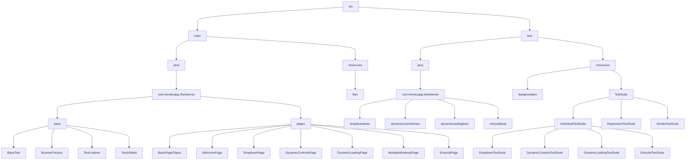

# Selenium project learning

## Steps

 - [X] Create project with skeleton of folders/files structure
 - [X] Create a repository on github
 - [X] Upload the project to the github repository
 - [ ] Create base package for tests
	 - [X] BaseTest
	 - [X] BrowserFactory
	 - [ ] TestListener
	 - [X] TestUtilities
 - [ ] Use test listeners for ALL tests
 - [ ] Use soft assert for ALL tests
 - [ ] Use logger for ALL tests
 - [ ] Take a screenshot at the end of every test and save on the right folder
	 - Add a test-output/screenshots folder and inside it each screenshot should follow the pattern:
		 - date/testsuitename/testname/methodname
 - [ ] Create a positive scenarios for each page
 - [ ] Create csv data providers
	 - Store the data providers on: src/test/resources/dataproviders/testname 
 - [ ] Test suites
	 - [ ] Create a test suite for each page
	 - [ ] Create smoke test for positive scenarios
	 - [ ] Create full regression test suite for all tests
 - [ ] Test on chrome
 - [ ] List of tests:
	 - [ ] [Welcome Page](https://the-internet.herokuapp.com)
	 - [ ] [Dropdown](https://the-internet.herokuapp.com/dropdown)
	 - [ ] [Dynamic Controls](https://the-internet.herokuapp.com/dynamic_controls)
	 - [ ] [Dynamic Loading](https://the-internet.herokuapp.com/dynamic_loading)
     - [ ] [Multiple Windows](https://the-internet.herokuapp.com/windows)
     - [ ] [Entry Ad](https://the-internet.herokuapp.com/entry_ad)

## Run Test Suites
This project uses XML test suites. To run the test suites run configuration should be created first:

1. Go to Run | Edit Configurations. 
2. In the left-hand pane, click Add New Configuration and from the list that opens, select TestNG. Name the new configuration.
3. From the Test kind list, select Suite -> The Suite field becomes available.
4. In the Suite field, click Browse and specify the path `src\test\resouces\TestSuites\`
5. Apply the changes and close the dialog.

## Project diagram

Project should follow this template of organization:

## TO DO
- Refactor code so Welcome Page is opened before every test
- Add error handling
- Add config file